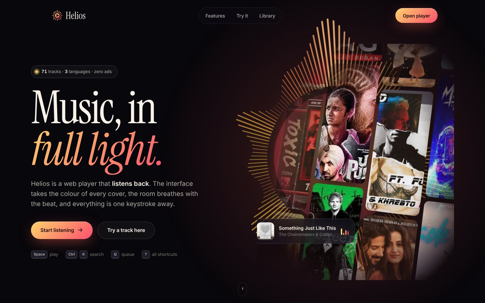
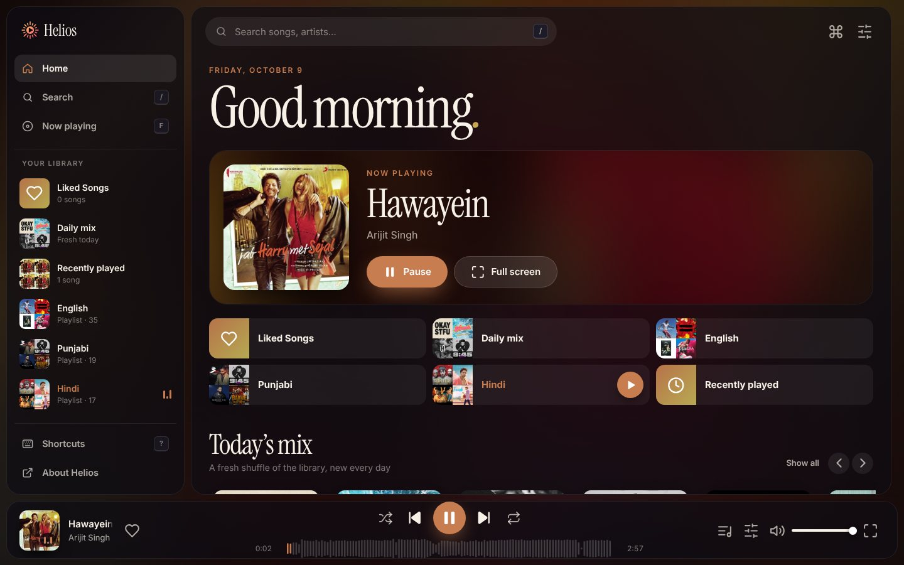
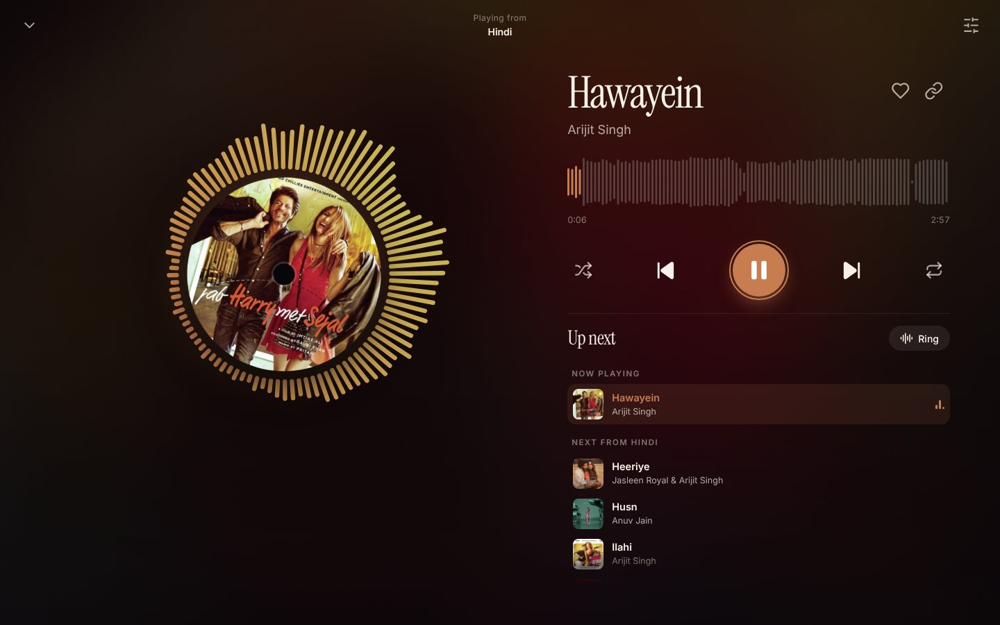

<p align="center">
  
</p>

<h3 align="center">Music, in full light.</h3>

<p align="center">
  An immersive web music player. The interface takes the colour of every cover,<br>
  the room breathes with the beat, and everything is one keystroke away.
</p>

<p align="center">
  <a href="https://music.lakshp.live"><b>Live demo</b></a> ·
  <a href="#features">Features</a> ·
  <a href="#keyboard-shortcuts">Shortcuts</a> ·
  <a href="#run-it-locally">Run it</a> ·
  <a href="#add-your-own-music">Add your music</a>
</p>

<p align="center">
  
</p>

<p align="center">
  
  
</p>

---

## Features

**Design**
- **Adaptive colour** — every cover's dominant palette is precomputed, and the whole UI (buttons, glows, waveform, room light) re-tints smoothly as the track changes.
- **Five ambiences** — *Art glow*, *Aurora*, *Vinyl* (a record that spins while you listen), *Vortex* (an audio-reactive tunnel) and *Calm*.
- **Now Playing** stage with three visualizers: mirrored **Bars**, a spinning-record **Ring**, and an oscilloscope **Wave**.
- Editorial typography (Instrument Serif + Inter, self-hosted), glass panels, a custom sun logo, and motion that respects `prefers-reduced-motion`.
- Fully responsive: sidebar + queue on desktop, icon rail on tablets, mini-player + tab bar + swipe-down sheet on phones.

**Playback**
- **Real waveform seekbar** — the scrubber is the decoded waveform of the song (placeholder shape appears instantly). Click, drag or use the keyboard; hover shows the time.
- **Queue that makes sense** — *Play next*, *Add to queue*, drag-to-reorder, clear, plus a live "next from…" list. Shuffle keeps the current track first and reshuffles on wrap.
- Repeat **off / all / one**, per-list **filter and sort**, likes, history, a daily seeded mix, artist pages.
- **3-band EQ** with presets (Bass boost, Vocal, Bright, Warm, Late night, Loudness), **playback speed** (pitch-preserving) and a **sleep timer** with a 15-second fade-out (or "end of track").
- Remembers everything on-device: track, position, volume, speed, EQ, ambience, queue, likes, history.

**Navigation & integration**
- **Command palette** (`Ctrl/⌘ K`): songs, artists and every action — `Shift ↵` plays next, `Ctrl ↵` queues.
- Search with fuzzy, accent-insensitive matching, language chips and a *Top result*.
- Shareable deep links (`player.html#/track/<name>`), context menu (right-click / `⋯`), toasts.
- **Media Session API**: hardware media keys, lock-screen and headset controls with artwork.
- Accessible by design: semantic controls, `aria` states, focus trapping in dialogs, visible focus rings, `inert` for hidden layers.

## Keyboard shortcuts

| Key | Action | Key | Action |
|---|---|---|---|
| `Space` | Play / pause | `S` | Shuffle |
| `←` `→` | Seek 5 s | `R` | Repeat: off → all → one |
| `Shift` + `←` `→` or `P` `N` | Previous / next | `L` | Like current song |
| `↑` `↓` | Volume | `V` | Cycle visualizer |
| `M` | Mute | `A` | Cycle ambience |
| `0`–`9` | Jump to 0 – 90 % | `Q` / `F` / `T` | Queue / Now Playing / Tune |
| `Ctrl/⌘ K` | Command palette | `/` | Search |
| `G` then `H` | Go home | `?` | All shortcuts |

## Run it locally

Helios is a static site — no build step, no dependencies. Serve the folder over HTTP:

```bash
git clone https://github.com/TheRealLaksh/Helios-Music-Player
cd Helios-Music-Player
npx http-server . -p 8080      # or: python3 -m http.server 8080
# open http://localhost:8080
```

> Serve over `http(s)`, not `file://`. The Web Audio graph (EQ, visualizers, waveform) needs a real origin; opened from a file, Helios still plays but disables those features and says so.

## Add your own music

1. Drop `track.mp3` into `Assets/music/` and `track.jpg` (square, ≥ 500 px) into `Assets/images/`.
2. Create a 360 px thumbnail in `Assets/thumbs/track.jpg` (used by lists and cards).
3. Add an entry to `js/data.js`:
   ```js
   { name: 'track', displayName: 'My Track', artist: 'Me', cover: 'track' }
   ```
4. Optional: add `track` to the `colors` map in `js/data.js` as `[[r,g,b],[r,g,b]]` for the adaptive palette (a warm default is used otherwise).

## Project structure

```
Helios-Music-Player/
├── index.html            Landing page
├── player.html           The player (app shell + icon sprite)
├── manifest.webmanifest  Installable web-app metadata
├── css/
│   ├── base.css          Tokens, fonts, reset, shared primitives
│   ├── landing.css       Landing page
│   └── player.css        Player, Now Playing, sheets, responsive layers
├── js/
│   ├── data.js           Library + precomputed cover colours
│   ├── store.js          Persistence, search, indexes, event bus
│   ├── engine.js         <audio> + Web Audio (EQ, analyser), waveform, speed, sleep timer
│   ├── ambience.js       Adaptive theme + the five backdrops
│   ├── player.js         Queue / shuffle / repeat / likes / history (no DOM)
│   ├── ui.js             Waveform, bar, Now Playing, queue, Tune, palette, menus
│   ├── views.js          Router + Home, playlists, search, artists, library
│   ├── app.js            Boot, animation loop, keyboard, Media Session
│   └── landing.js        Landing: cover wall, live demo, audio-reactive sun
└── Assets/
    ├── brand/            Logo (SVG), favicons, app icons, social image
    ├── fonts/            Instrument Serif, Inter (SIL OFL)
    ├── images/           Full-size covers
    ├── thumbs/           360 px thumbnails
    └── music/            Audio
```

## Notes

- The waveform is decoded from the audio file in the browser, which downloads the track a second time. It is skipped automatically on *Save-Data*, cellular and slow connections.
- No frameworks, no trackers, no network calls beyond your own static files.

## Credits

Designed and built by **Laksh Pradhwani**.
Fonts: [Instrument Serif](https://fonts.google.com/specimen/Instrument+Serif) and [Inter](https://rsms.me/inter/), both under the SIL Open Font License.

<p align="center">
  <a href="mailto:laksh.pradhwani@gmail.com"></a>
  <a href="https://github.com/TheRealLaksh"></a>
  <a href="https://www.linkedin.com/in/laksh-pradhwani"></a>
</p>
